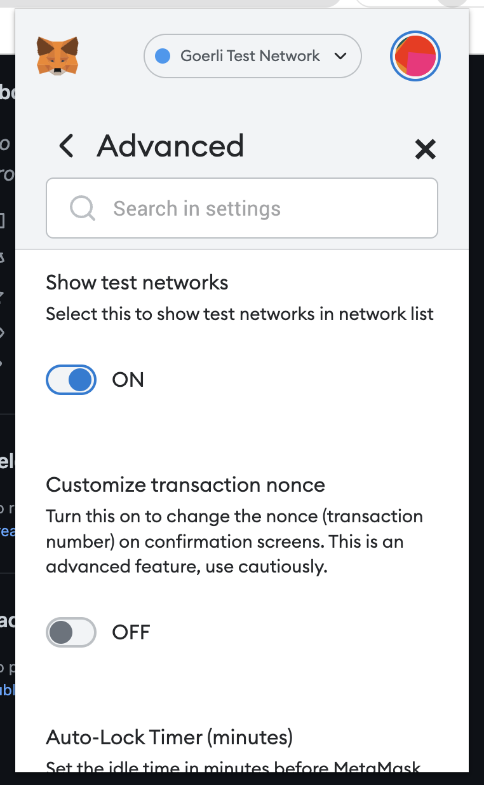
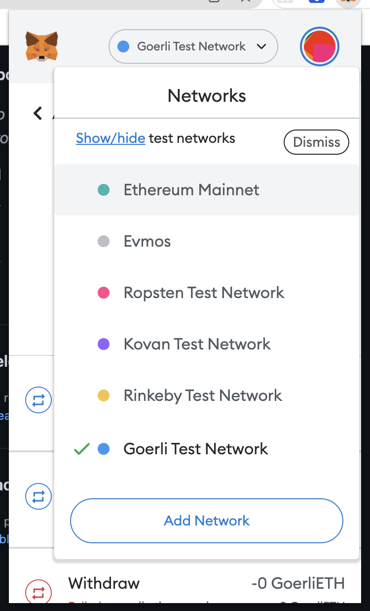
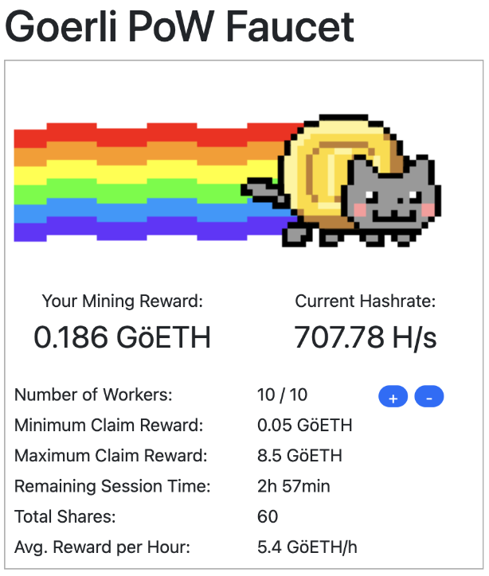
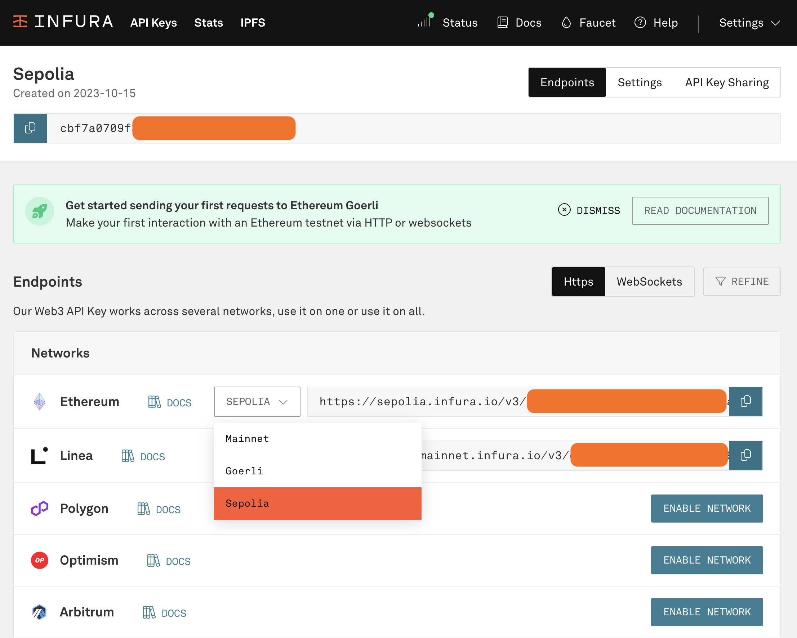
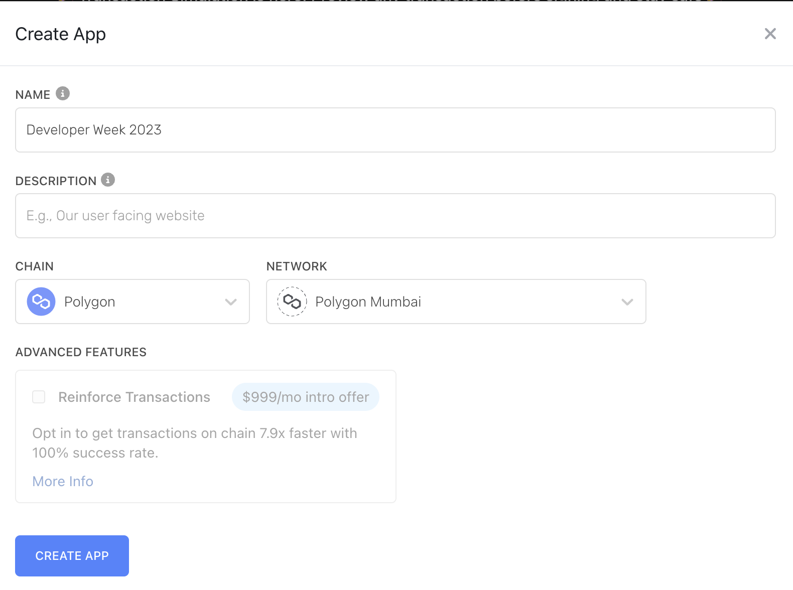

# Deploy your first smart contract

As blockchain technology continues to flourish, companies are moving towards building their applications on-chain using smart contracts. In this workshop, we will discuss how Ethereum smart contracts work and go over related concepts like gas fees, the Ethereum Virtual Machine (EVM), customizable event classes, wallets and identities, visualization tools, and more. We will then get familiar with the Solidity programming language and write a simple smart contract together. Afterward, we will deploy the smart contract to an Ethereum test network through the latest Ethereum development tools like Hardhat and the MetaMask wallet. After we test some interactions with our deployed smart contract, you’ll feel empowered to write, test, and deploy your own smart contract to bring blockchain to your use case.

# Pre-workshop to-do list

- Set up a Node development environment on your machine. 
  * [Setup on Windows](https://docs.microsoft.com/en-us/windows/dev-environment/javascript/nodejs-on-windows)
  * [Setup on Mac](https://progate.com/docs/nodejs-env)
  * You should be able to run `node` and `npm` commands from your Terminal
- Hardhat: `npm install --save-dev hardhat`
- You could choose to deploy to Goerli or Polygon Mumbai, adjust your settings/environment variables accordingly.
- MetaMask Wallet: Make sure you have some Goerli Test Network ETH or Polygon Mumbai MATIC in your MetaMask Wallet before the workshop
  * Install Metamask as a browser extension – use Chrome or Firefox. 
  * Make sure the “Show test networks” setting under “Advanced” is set to on.  
  * 
  * Switch to the Görli Testnet/ Polygon Mumbai network in your MetaMask wallet. 
  * 
  * Use a Goerli/Polygon Mumbai Faucet to request some funds. [Watch the tutorial](https://www.youtube.com/watch?v=nsAuqfAQCag). Faucets can be found [here](https://goerli-faucet.mudit.blog/) or [here](https://goerli-faucet.pk910.de/)
  * 
- [Infura for Goerli](https://infura.io/login): Sign up for a free account and create a Goerli Network endpoint  
  
- [Alchemy for Polygon Mumbai](https://alchemy.com): Sign up for a free account and create a Polygon Mumbai endpoint
  * 
- Set environment variables that are needed in the Hardhat config file:

```export INFURA_URL_GOERLI=<Copy and paste the network endpoint URL from Infura>```

```export PRIVATE_KEY_GOERLI=<Copy and paste your MetaMask wallet private key>```

or

```export ALCHEMY_URL_MUMBAI=<Copy and paste the Polygon Mumbai network endpoint URL from Alchemy>```

```export PRIVATE_KEY_MUMBAI=<Copy and paste your MetaMask wallet private key>```

- If you'd like to test interacting with your smart contract from a Node application, modify the contract address in `demo/interact.js`, and please set the following environment variable.

```export GOERLI_ACCOUNT_ADDRESS=<Copy and paste your MetaMask Goerli account address>```

or

```export MUMBAI_ACCOUNT_ADDRESS=<Copy and paste your MetaMask Polygon Mumbai account address>```


To run the script, execute ```node interact.js```


# Additional learning materials
- [Intro to Ethereum and Smart Contracts](https://ethereum.org/en/developers/docs/intro-to-ethereum/)
- [Intro to Decentralized Applications(Dapps)](https://ethereum.org/en/developers/docs/dapps/)
- [Web 3.0 Tutorial: Deploy & Verify Smart Contract using Hardhat - Ethereum (Testnet & Mainnet)](https://www.youtube.com/watch?v=0cIkcFspdaE)
- [Intro to Solidity](https://www.geeksforgeeks.org/introduction-to-solidity/)
- [Solidity Variables](https://www.tutorialspoint.com/solidity/solidity_variables.htm)
- [Contract ABIs](https://docs.soliditylang.org/en/v0.5.3/abi-spec.html)
- [Blockchain Use Cases - Banking & Finance](https://www.kaleido.io/industries/banking-and-finance)
- [Kaleido Blockchain Customer Stories -- includes WWF, CDC](https://www.kaleido.io/customer-stories)
